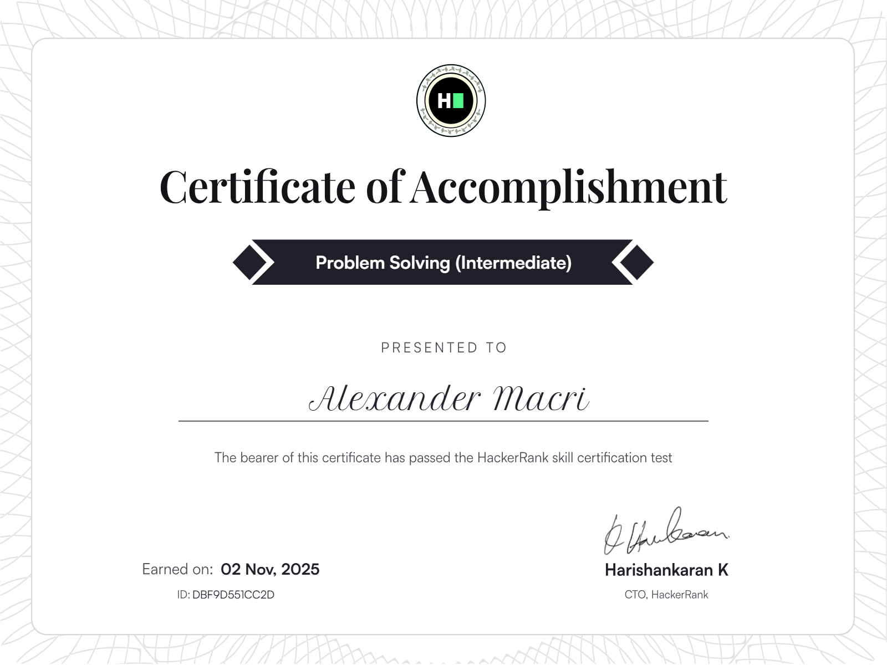
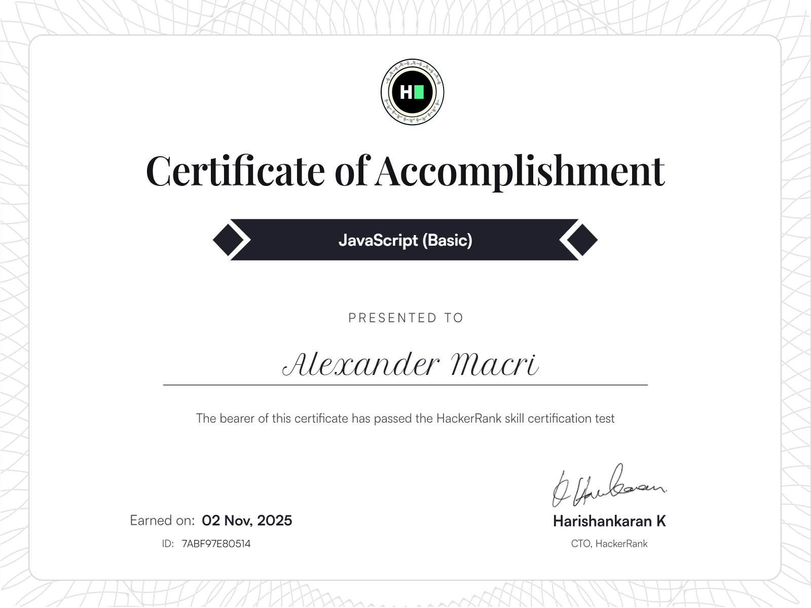
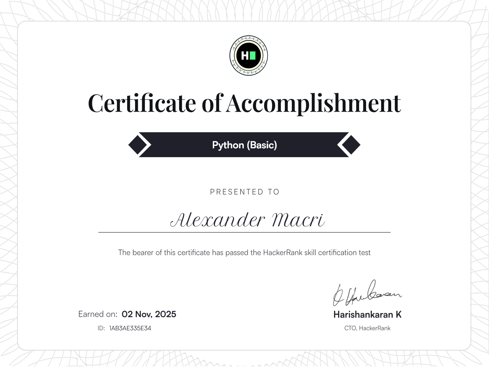

<h1 align="center">
  

  Hi :) I'm Yolanda 🌈 
</h1>

<h3 align="center">  I really like music 🎧💜</h3>

<article class="markdown-body entry-content container-lg f5" itemprop="text">

<h1 class="heading-element" dir="auto">
  <svg class="octicon octicon-link" viewBox="0 0 16 16" version="1.1" width="16" height="16" aria-hidden="true"><path d="m7.775 3.275 1.25-1.25a3.5 3.5 0 1 1 4.95 4.95l-2.5 2.5a3.5 3.5 0 0 1-4.95 0 .751.751 0 0 1 .018-1.042.751.751 0 0 1 1.042-.018 1.998 1.998 0 0 0 2.83 0l2.5-2.5a2.002 2.002 0 0 0-2.83-2.83l-1.25 1.25a.751.751 0 0 1-1.042-.018.751.751 0 0 1-.018-1.042Zm-4.69 9.64a1.998 1.998 0 0 0 2.83 0l1.25-1.25a.751.751 0 0 1 1.042.018.751.751 0 0 1 .018 1.042l-1.25 1.25a3.5 3.5 0 1 1-4.95-4.95l2.5-2.5a3.5 3.5 0 0 1 4.95 0 .751.751 0 0 1-.018 1.042.751.751 0 0 1-1.042.018 1.998 1.998 0 0 0-2.83 0l-2.5 2.5a1.998 1.998 0 0 0 0 2.83Z"></path></svg></a>

  

  
  

 
</article>

<h2 class="heading-element" dir="auto"> About me :</h2> 

<!-- 

  
  
    
  
  
  

 -->

- 🎓 I'm working toward my **PhD in Artificial Intelligence**, specializing in advanced ML systems and intelligent automation.
- 🌱 Growing my expertise in **Data Science & Artificial Intelligence** and **Full-Stack Development**.
- 🎯 I aim to contribute to impactful **open source project** and help strengthen the global developer community.
- ✨ I love participating in global **algorithm and Coding Competitions**.
- 💬 Feel free to ask me about **Python, AI/DL, LLM, Computer Vision, FastAPI and modern web frameworks**

## Research & Engineering Focus

- **Edge AI Optimization** - Improving model performance, CUDA acceleration, and hardware efficiency.     
- **Temporal ML & Code Evolution** - Studying how AI systems and codebases change over time.   
- **AI Agent Architecture** - Designing and benchmarking next-generation agent frameworks.   
- **Neural Network Training Efficiency** - QLoRa, fine-tuning pipelines, and scalable model optimization.   
- **Mathematical ML Foundations** - Linking theoretical math to practical AI implementations.
- **Full-Stack Engineering** - Building production-ready applications using modern frontend tools and backend APIs.  
- **Next-Gen AI/ML Developer Tools** - Creating powerful workflows for future AI engineers.  

## Language and Tools

  

<h3 align="center">💻💜 I love this job 💜🌿</h3>

<!-- 

https://github.com/user-attachments/assets/6ec6585f-bed9-4ce8-884c-f70974b222de

 

 
 -->

 

    <h2 class="heading-element" dir="auto"> My activity statistics on GitHub</h2>
    <picture>
  <source media="(prefers-color-scheme: dark)" srcset="https://raw.githubusercontent.com/Hiras1388/Hiras1388/output/pacman-contribution-graph-dark.svg">
  <source media="(prefers-color-scheme: light)" srcset="https://raw.githubusercontent.com/Hiras1388/Hiras1388/output/pacman-contribution-graph.svg">
  
  </picture>
  

<h2 class="heading-element" dir="auto">My github stats  

 </h2>

   
  

   
  

 
   
  

 

  
  

